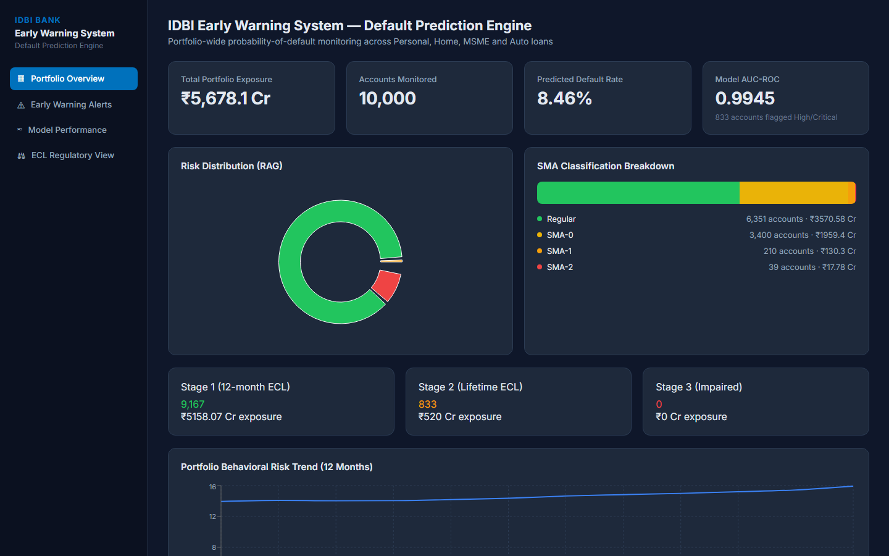
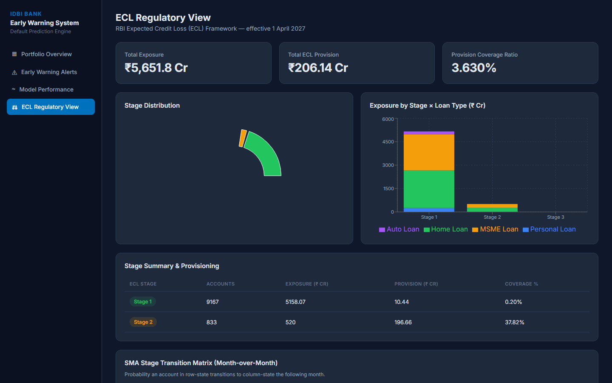
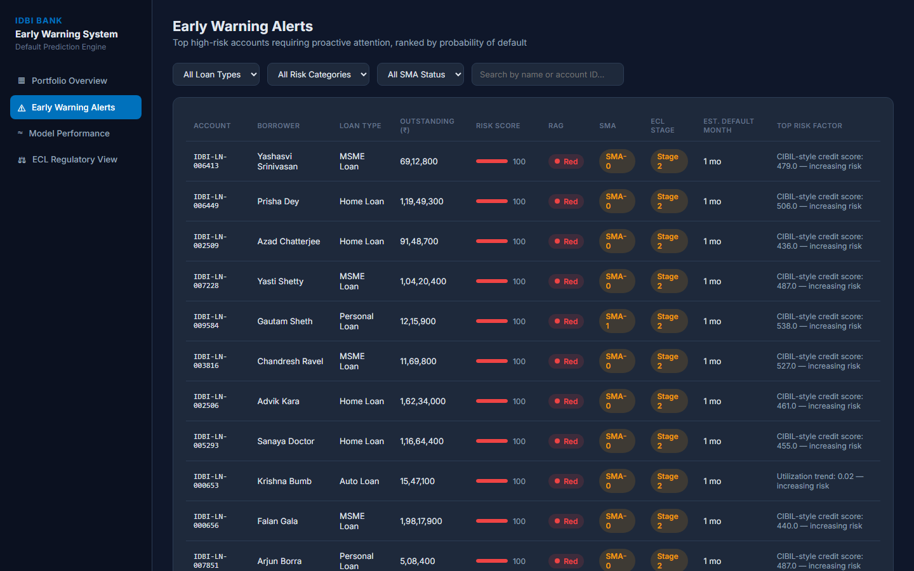
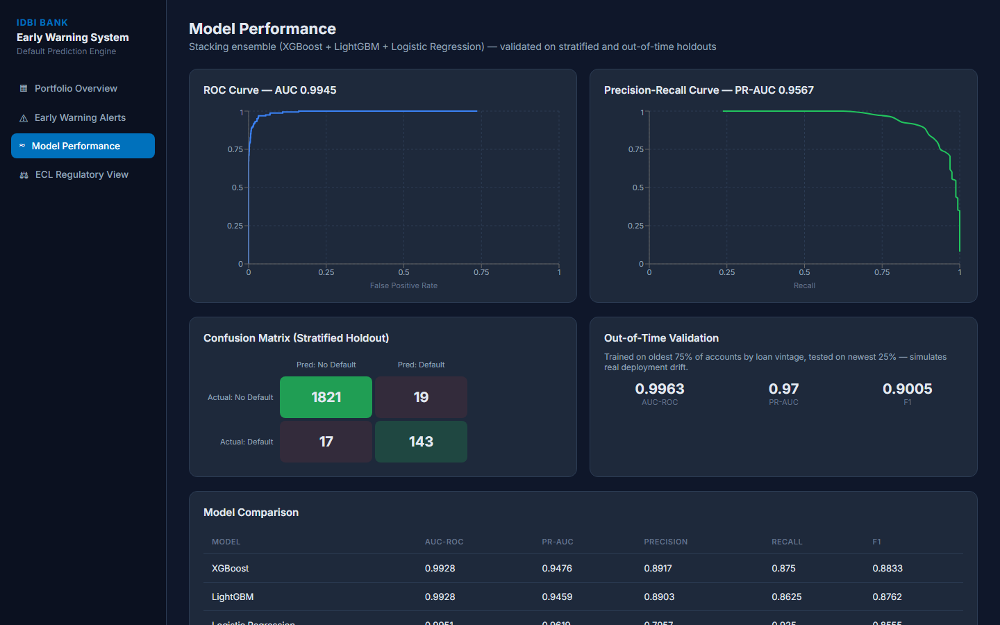
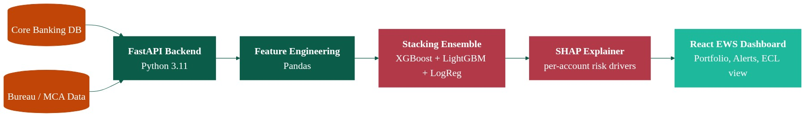

# PS4 — IDBI Early Warning System: Default Prediction Engine


> **IDBI Innovate 2026 — Problem Statement 4.** A 12-month probability-of-default
> (PD) scoring engine for IDBI's retail/MSME loan portfolio, built on a
> stacking ensemble (XGBoost + LightGBM + Logistic Regression), aligned to
> RBI's incoming ECL framework and SMA/NPA classification norms.
>
> **All data here is synthetic.** See [`DISCLAIMER.md`](./DISCLAIMER.md)
> before treating any number in this README as a claim about real-world
> performance.

## Why this exists

Most default-prediction workflows catch risk late — typically once an
account is already delinquent, using a 3-month lookback window and
structured bureau data alone. That leaves banks reacting to defaults instead
of pre-empting them, and it doesn't map cleanly onto RBI's upcoming Expected
Credit Loss (ECL) framework (effective April 2027), which needs forward-looking,
stage-aware PD estimates rather than a point-in-time delinquency flag.

This project explores an **early-warning-first** design: predict default risk
**12 months in advance**, blend structured loan data with a synthetic
behavioral time series (payment discipline, utilization trend, digital
activity, EMI-bounce pattern) and external risk factors (industry, geography,
macro-stress), and surface it through ECL-style staging (Stage 1/2/3),
RAG status, and per-account SHAP-explained risk drivers — so a relationship
manager or risk team gets a "why", not just a score.

## Key features

- **12-month-ahead PD scoring** via a stacking ensemble (XGBoost + LightGBM +
  Logistic Regression meta-learner), trained with SMOTE class balancing on an
  ~8% synthetic default rate.
- **Stratified AUC-ROC = 0.9945** and **out-of-time AUC-ROC = 0.9963**
  (train = oldest 75% of accounts by loan vintage, test = newest 25% —
  the standard credit-risk OOT methodology), as reported in
  [`backend/reports/model_performance.json`](./backend/reports/model_performance.json).
  These are measured on synthetic data — see the Disclaimer.
- **SHAP-explained risk drivers** per account (`TreeExplainer` on the XGBoost
  base learner), satisfying RBI's FREE-AI framework expectation of AI
  explainability in credit-risk models.
- **ECL Stage 1/2/3 staging** with loan-type-specific LGD assumptions and a
  stage-transition matrix, plus an SMA-0/1/2/NPA classification derived from
  days-past-due.
- **Portfolio-level views**: risk/RAG/SMA/ECL distribution, exposure
  concentration by loan type × city tier, 12-month behavioral trend, and a
  Mild/Moderate/Severe macro stress test.
- **Live scoring API**: a `/predict` endpoint that runs the same feature
  pipeline used in training against an arbitrary account payload.

## Screenshots

| Portfolio Home | ECL Staging |
|---|---|
|  |  |

| Early-Warning Alerts | Model Performance |
|---|---|
|  |  |

## Architecture



```
backend/
  scripts/generate_data.py   synthetic 10,000-account loan book + 12-month time series
  ml/feature_engineering.py  shared feature builder (used by BOTH training and live /predict)
  ml/risk_logic.py           risk category / RAG / ECL stage / prescriptive actions / SHAP formatting
  ml/train_model.py          trains XGBoost, LightGBM, Logistic Regression + stacking ensemble,
                              SHAP explanations, stratified + out-of-time validation, batch-scores
                              the full portfolio
  app/main.py                FastAPI serving layer (9 endpoints, loads pre-trained models)
  tests/                     pytest suite for risk_logic.py and feature_engineering.py
frontend/
  src/                       React 19 + Recharts dashboard (portfolio, alerts, ECL, model performance)
```

The backend trains offline (`train_model.py`) and persists models + a
batch-scored portfolio to disk; the FastAPI layer (`app/main.py`) loads those
artifacts at startup and serves both the pre-scored portfolio and live
`/predict` calls through the exact same `feature_engineering.py` transform,
so there's no train/serve skew.

## How to run locally

### Backend (Python 3.11 — XGBoost/LightGBM/SHAP wheels are not yet available for 3.14)

```bash
cd backend
py -3.11 -m venv venv
./venv/Scripts/pip install -r requirements.txt      # venv/bin/pip on macOS/Linux

# 1. Generate the synthetic portfolio (10,000 accounts, 120,000 monthly snapshots)
./venv/Scripts/python scripts/generate_data.py

# 2. Train models, run SHAP + validation, batch-score the portfolio
./venv/Scripts/python ml/train_model.py

# 3. Serve the API
./venv/Scripts/python -m uvicorn app.main:app --reload --port 8000
```

Interactive API docs: http://127.0.0.1:8000/docs

### Frontend (React 19 + Vite)

```bash
cd frontend
npm install
npm run dev
```

### Tests

```bash
cd backend
./venv/Scripts/python -m pytest tests/ -v
```

## Endpoints

| Method | Path | Purpose |
|---|---|---|
| GET | `/` | Health check |
| POST | `/predict` | Live PD scoring for an arbitrary account (JSON body) |
| GET | `/portfolio` | Portfolio-level exposure, risk/SMA/ECL distribution, concentration |
| GET | `/portfolio/trends` | 12-month behavioral risk trend, overall + by loan type |
| GET | `/alerts` | Top-N highest-risk accounts (filterable by loan type, risk category, SMA, search) |
| GET | `/account/{account_id}` | Full deep-dive: SHAP drivers, payment history, risk trend |
| GET | `/model/performance` | AUC/PR-AUC/F1, confusion matrix, ROC/PR curves, feature importance, OOT validation |
| GET | `/stress-test` | Portfolio impact under Mild/Moderate/Severe macro stress scenarios |
| GET | `/ecl-summary` | Stage 1/2/3 exposure, provisioning estimate, stage transition matrix |

## Known Limitations

| Limitation | Detail |
|---|---|
| **Synthetic data only** | All accounts, transactions and outcomes are generated by `backend/scripts/generate_data.py`, not real IDBI or bureau data. See `DISCLAIMER.md`. |
| **Structured data only** | The model uses structured loan/bureau-style fields and a synthetic behavioral time series. It does **not** yet ingest unstructured or public-domain data (news sentiment, MCA/GST filings). This was already an honestly-listed gap in the original pitch deck, not a claimed capability. |
| **Illustrative ECL, not regulatory ECL** | LGD assumptions are simplified loan-type-level constants; Stage 2 lifetime PD is an approximation (12m PD × 2.2, capped at 1.0). Not an Ind AS 109 / IFRS 9-compliant provisioning engine. |
| **No entity-relationship / network view** | Related-party, group-company, or money-flow relationships between borrowers are not modeled — each account is scored independently. |
| **SHAP surrogate, not full-ensemble explanation** | Explainability uses `TreeExplainer` on the XGBoost base learner as an interpretable surrogate, since explaining the full stacking ensemble directly isn't straightforward. |
| **No live core-banking integration** | Runs against a static synthetic CSV snapshot; there's no live feed from a core banking or bureau system. |
| **No model governance/monitoring layer** | No drift detection, champion/challenger framework, or automated retraining pipeline — this is a single offline training run. |

## Next Phase / Roadmap

- **Structured + unstructured + public-domain data fusion.** Bring in signals
  the model doesn't see today: MCA filings (director changes, charge
  creation/satisfaction, related-party disclosures) for MSME/corporate
  borrowers, and news/media sentiment around a borrower's industry or named
  entity, to catch stress signals that show up in public records before
  they show up in payment behavior.
- **Graph-based entity-relationship modeling.** Move from independent
  per-account scoring to a graph neural network over borrowers, guarantors,
  and related entities (shared directors, addresses, beneficial owners) so
  the system can trace money flow between related accounts — aimed at
  surfacing circular-trading patterns and shell-company-style default risk
  that a single-account model structurally cannot see.
- **Federated risk-signal sharing across lending verticals.** IDBI's retail,
  MSME, and corporate lending books are scored independently today. A
  federated approach would let early-warning signals from one vertical
  (e.g., an MSME borrower's group entity showing stress in the corporate
  book) inform risk scoring in another, without centralizing raw customer
  data across verticals.
- **Regulatory-grade ECL.** Replace the current simplified LGD/lifetime-PD
  approximations with collateral-adjusted LGD models, macro-scenario-weighted
  lifetime PD curves, and an auditable staging-override workflow, in line
  with RBI's ECL framework effective April 2027.
- **Model governance.** Add drift monitoring, a champion/challenger
  evaluation framework, and a retraining pipeline validated against a
  growing, real (permissioned) loan book rather than a single synthetic
  training run.

## Modeling notes

- **Class imbalance**: SMOTE oversampling on the training fold +
  `class_weight="balanced"`.
- **Validation**: stratified 80/20 holdout (primary metrics) + a genuine
  **out-of-time** holdout — trained on the oldest 75% of accounts by loan
  vintage (disbursement date), tested on the most recent 25%.
- **NPA accounts** (already 90+ DPD) are excluded from model *training*
  (predicting a default that has already happened is circular) but are
  still scored deterministically (PD = 0.99, Stage 3) and included in all
  portfolio/ECL views.
- Synthetic data is generated so that **~28% of defaults show minimal prior
  behavioral warning** and **~5% of healthy accounts show a temporary,
  self-resolving stress blip** — this keeps model performance realistic
  (recall/precision in the high-80s/90s, not a trivial 100%) rather than
  leaking the label directly into the features.

## Disclaimer

This is a hackathon prototype built entirely on synthetic data. It is not
connected to, and does not represent, any real IDBI Bank system, customer,
or account. See [`DISCLAIMER.md`](./DISCLAIMER.md) for the full disclosure,
including exactly what the generator fabricates and how the reported
AUC-ROC figures should (and shouldn't) be read.
